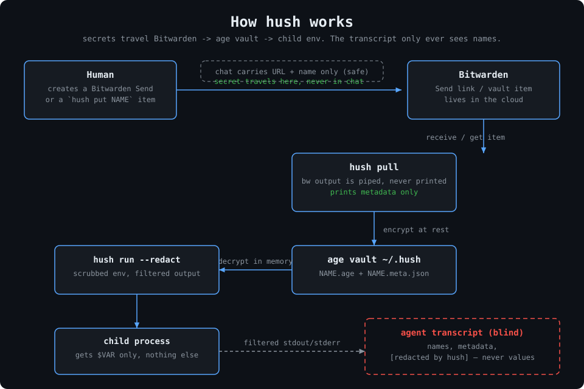

# hush

```
██╗  ██╗██╗   ██╗███████╗██╗  ██╗
██║  ██║██║   ██║██╔════╝██║  ██║
███████║██║   ██║███████╗███████║
██╔══██║██║   ██║╚════██║██╔══██║
██║  ██║╚██████╔╝███████║██║  ██║
╚═╝  ╚═╝ ╚═════╝ ╚══════╝╚═╝  ╚═╝
```

Agent-blind secrets for humans and coding agents. The value is shared over **Bitwarden** (Send link or vault item), is stored encrypted with **age**, and is used by **name**. The CLI never prints plaintext.

MIT. Open source at [github.com/turinglabsorg/hush](https://github.com/turinglabsorg/hush).



```
┌────────┐  Send URL + name   ┌────────────┐piped, never printed ┌────────────┐
│ Human  │ ─────────────────▶ │ hush pull  │ ──────────────────▶ │ age vault  │
│ Agent  │    (chat-safe)     │ metadata   │                     │ ~/.hush/   │
└────────┘                    └────────────┘                     └─────┬──────┘
                                                                       │ decrypt in memory
                                                                       ▼
                                                               ┌────────────┐    ┌────────────────────┐
                                                               │ hush run   │ ──▶│ transcript (blind) │
                                                               │ --redact   │    │ [redacted by hush] │
                                                               └────────────┘    └────────────────────┘
```

```
bitwarden Send link  →  hush pull --name stripe-prod --send <url>  →  ~/.hush/vault/stripe-prod.age
agent chat: "use hush:stripe-prod"
hush run --name stripe-prod --env STRIPE_API_KEY --redact -- curl ...
```

The agent gets its own Bitwarden account (its own vault, optionally via `BITWARDENCLI_APPDATA_DIR`). Humans share secrets with it through **Bitwarden Send**, or through vault items (shared org collection) named `hush put NAME`.

## Install

Install the latest GitHub Release (SHA-256 verified; cosign if present):

```bash
curl -fsSL https://raw.githubusercontent.com/turinglabsorg/hush/main/install.sh | sh
```

With the agent skill and a PATH symlink:

```bash
curl -fsSL https://raw.githubusercontent.com/turinglabsorg/hush/main/install.sh | sh -s -- --agent-skill --path-link
```

Pin a version with `--version v0.4.1`. Build from a checkout with `--from-source`.

Needs the [Bitwarden CLI](https://bitwarden.com/help/cli/) (`bw`) on `PATH` (or `HUSH_BW_BIN`).

Then:

```bash
bw login --apikey   # or `bw login` interactively; `bw config server <url>` first if self-hosted
bw unlock           # export the printed BW_SESSION
export BW_SESSION="..."
hush init
hush doctor --json  # must report ok
```

## Agent email

If the agent needs its own inbox — e.g. to receive the verification mail
for its Bitwarden account — use [ambox.dev](https://ambox.dev):
agent-first, end-to-end encrypted email (`your-agent@ambox.dev`), open
source. That is how the live end-to-end check above registered its test
account.

## Generate locally

When a new credential must originate on the agent machine, generate and
encrypt it in one step. The plaintext is never written to stdout:

```bash
hush generate bitwarden-master-password --json
```

The default is 32 random bytes encoded as 64 hexadecimal characters. Use
`--bytes` to choose 16–128 random bytes. Existing names are protected unless
`--force` is explicitly supplied. Consume the stored value only through
`hush run --redact`.

For an agent-owned Bitwarden account, keep its master password under
`BITWARDEN_MASTER_PASSWORD` and let Hush perform login or unlock without
exposing either the password or the resulting session:

```bash
hush bitwarden unlock --email agent@example.com --json
hush run --name BITWARDEN_SESSION --env BW_SESSION --redact -- \
  hush pull --name stripe-prod --json
```

If Bitwarden locks again, rerun `hush bitwarden unlock`. Hush reads the stored
master password, obtains a fresh session, and replaces only the encrypted
`BITWARDEN_SESSION` entry. Custom secret names are available through
`--master-secret` and `--session-secret`.

## Deposit

**Option A — Bitwarden Send (recommended).** Create a text Send with the secret, then in the agent chat paste only the Send **URL** (URLs are not secret) plus the name:

> Store this as `stripe-prod`: https://vault.bitwarden.com/#/send/...

The agent runs:

```bash
hush pull --name stripe-prod --send <url> --json
```

For a password-protected Send, hand the password over out of band and use `--passwordenv VAR` or `--passwordfile PATH` (never a literal `--password` on the command line). `hush pull` receives the Send, encrypts, writes the vault, and prints **metadata only**:

```json
{"event":"stored","name":"stripe-prod","sender":"self","replaced":false}
```

**Email-gated Sends.** If the Send is restricted to an email address, pass `--email` plus one code source. hush drives the whole verification (submit address → wait for the code mail → submit newest code) in a single call; codes are single-use and minted per attempt, so always submit the newest one:

```bash
hush pull --name stripe-prod --send <url> --email agent@example.com --code-cmd '<hook prints ONLY the code>' --json
# or: --codeenv VAR / --codefile PATH   (fresh code already in hand)
# tune: --code-timeout 300 --code-poll 10
```

The hook is polled until it prints a code; hush ignores anything the hook returned before minting, so a slow mailbox can never feed a stale code. Rejected code → retry `hush pull` for a fresh one.

**Option B — vault item.** Add an item to the agent's vault (or a shared org collection) named exactly `stripe-prod` (secret in the password or notes field), or named `hush put stripe-prod`. Then:

```bash
hush pull --name stripe-prod --json
hush pull --json   # one-shot scan for all `hush put NAME` items
```

Add `--consume` to trash the vault item after it is stored. `hush listen` is the polling daemon variant (human use). Agents should use `pull`.

## Share a secret

Create an expiring, hidden-text Bitwarden Send from an encrypted vault entry:

```sh
hush send --name SERVICE_PASSWORD --title "Service access" --days 7 --json
```

The command prints only a Send link and expiry metadata. It uses the ambient
Bitwarden session or the encrypted `BITWARDEN_SESSION`, sends the payload through
subprocess stdin, and never places the value in arguments or temporary files.
The sender email is hidden. `--days` accepts 1–31 days and controls both expiration
and deletion; `--max-access-count` optionally limits retrievals. Only nonempty
UTF-8 text up to 1,000 characters is accepted. Raw Bitwarden failure output is
discarded to prevent a failed command from leaking the text or session.

## Use

```bash
hush list --json
hush run --name stripe-prod --env STRIPE_API_KEY --redact -- \
  curl https://api.stripe.com/v1/charges
```

There is no `show` / `get`. Decrypt happens in memory and is injected into the child environment.
Agents always use `--redact`: child stdout/stderr is filtered so every
occurrence of the secret becomes `[redacted by hush]`.

## Agent sandbox

The skill tells the agent the rules; these mechanisms enforce them.

```bash
hush agent-shim --dir ~/.hush/agent-bin   # human: put FIRST in agent PATH
hush doctor --json                        # checks 0700/0600 modes + setup
```

- **Direct `bw` is blocked.** The shim installed as `bw` in the agent's PATH
  refuses every call with a pointer back to hush. Without it, `bw send
  receive <url>` needs no login and prints the secret straight into the
  transcript. The human keeps using the real `bw`; hush itself via `HUSH_BW_BIN`.
- **Secret-bearing env never reaches the child.** `hush run` strips
  `BW_SESSION`, `BW_CLIENTID`, `BW_CLIENTSECRET`, `BW_PASSWORD` and
  `BITWARDENCLI_APPDATA_DIR`: the child gets secrets only through `--env`.
  Otherwise a child shell could read the session and drive `bw` itself.
- **`--redact` filters child output** (streaming, boundary-safe), so even a
  command that echoes its input cannot leak into logs.
- **`doctor` fails on loose permissions** (`~/.hush` must be 0700,
  `identity` 0600) and reports whether the effective `bw` is a shim.

Honest limit: on one shared Unix user these are guardrails, not a proof —
a determined process can still exec the real `bw` by absolute path or read
the identity file. The hard sandbox (phase 2) is a dedicated agent user
plus a `hushd` broker owning the identity and the Bitwarden session, with
the agent talking to it over a Unix socket and never touching key material.
Until then: separate users where you can, shim + `--redact` everywhere.

## Layout

```
~/.hush/config.json
~/.hush/identity          # age X25519, mode 600
~/.hush/vault/<name>.age
~/.hush/vault/<name>.meta.json
```

Override the home directory with `--home` or `HUSH_HOME`. Point at another `bw` binary with `HUSH_BW_BIN`. `bw` auth (`BW_SESSION`, `BITWARDENCLI_APPDATA_DIR`) is inherited from the environment.

## Threat model

Hush stops secrets from entering **agent transcripts**: `bw` output is piped, never printed. It does not protect you from a process running as the same OS user with the identity file. `hush run` is the supported use path; reading vault ciphertext is expected, reading identity + decrypting is the bypass. Never run `bw get` / `bw send receive` by hand in front of an agent — the value would land in the transcript.

## Development

```bash
cargo fmt --check
cargo clippy --locked -- -D warnings
cargo test --locked
```

Integration tests stub the Bitwarden CLI with `tests/fixtures/fake-bw.sh` (via `HUSH_BW_BIN` + `FAKE_BW_DIR`).
Live end-to-end (real account + server) was verified manually: Send receive → `pull --send`,
vault item → `pull` scan, `--consume` trash, `listen` poll, and `run` injection (compared by hash, never printed).

## License

[MIT](LICENSE). Copyright (c) 2026 Turing Labs.
